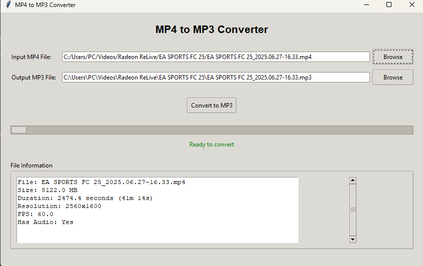

**Quick Start for Windows Users:**

> Download the `.exe` file from the `dist` folder (or a release) and run it—no installation required! No need to install Python or any dependencies.



# MP4 to MP3 Converter

A simple GUI application to convert MP4 video files to MP3 audio files using Python and Tkinter.

## Features

- **User-friendly GUI**: Easy-to-use interface with file browsers
- **File information display**: Shows video duration, resolution, file size, and other details
- **Progress indication**: Visual progress bar during conversion
- **Auto-naming**: Automatically suggests output filename based on input file
- **Error handling**: Comprehensive error messages and validation
- **Threaded conversion**: Non-blocking conversion process

## Installation and Usage

### Option 1: Run from Source

1. Install Python 3.7 or higher
2. Install required packages:
   ```bash
   pip install -r requirements_gui.txt
   ```
3. Run the application:
   ```bash
   python mp4_to_mp3_gui.py
   ```

### Option 2: Build Executable

1. Install Python 3.7 or higher
2. Run the build script:
   ```bash
   python build_exe.py
   ```
   or on Windows:
   ```cmd
   build_exe.bat
   ```
3. The executable will be created in the `dist` folder

## How to Use

1. **Select Input File**: Click "Browse" next to "Input MP4 File" to select your video file
2. **Choose Output Location**: Click "Browse" next to "Output MP3 File" to choose where to save the audio file (or use the auto-generated name)
3. **View File Information**: The application will display information about your video file
4. **Convert**: Click "Convert to MP3" to start the conversion process
5. **Monitor Progress**: Watch the progress bar and status messages
6. **Done**: You'll get a success message when conversion is complete

## Requirements

- Python 3.7+
- moviepy (for video processing)
- tkinter (usually included with Python)
- pyinstaller (for building executable)

## File Structure

```
mp4tomp3/
├── mp4_to_mp3.py          # Original simple script
├── mp4_to_mp3_gui.py      # GUI application
├── requirements_gui.txt    # Python dependencies
├── build_exe.py           # Build script (Python)
├── build_exe.bat          # Build script (Windows batch)
└── README.md              # This file
```

## Troubleshooting

### Common Issues

1. **"No audio track" error**: The selected MP4 file doesn't contain audio
2. **"Permission denied" error**: Choose a different output location or run as administrator
3. **"File not found" error**: Ensure the input file path is correct

### Performance Tips

- Larger video files take longer to convert
- The application shows file information before conversion
- Conversion runs in background, so you can still use the interface

## Building for Distribution

The executable created by PyInstaller is self-contained and can be run on Windows machines without Python installed. The build process:

1. Creates a virtual environment (optional but recommended)
2. Installs all required packages
3. Uses PyInstaller to create a single executable file
4. Includes all necessary libraries and dependencies

## License

This project is open source and available under the MIT License.
